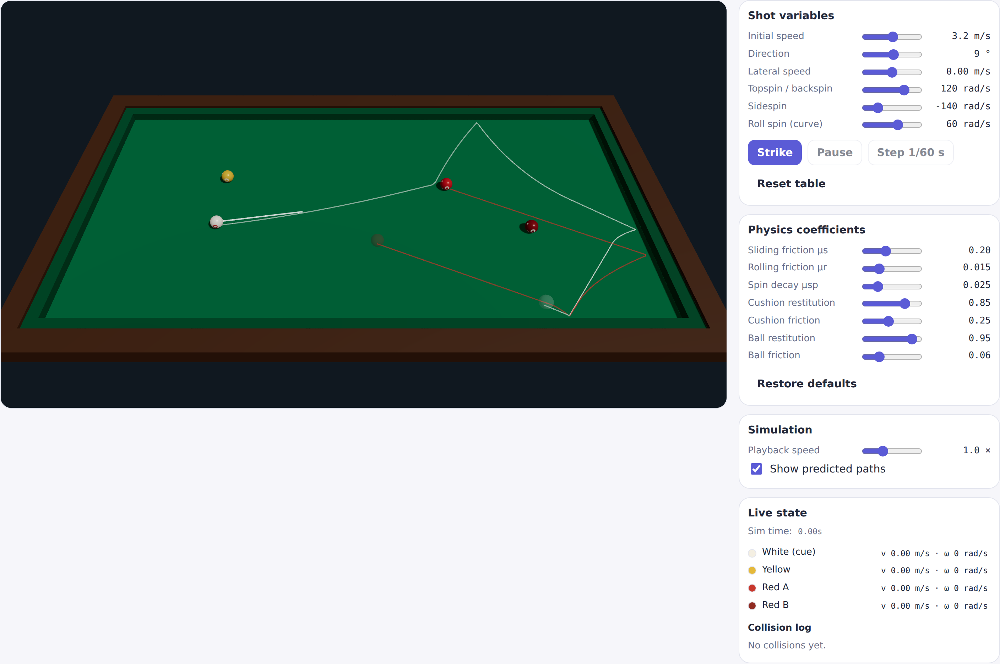
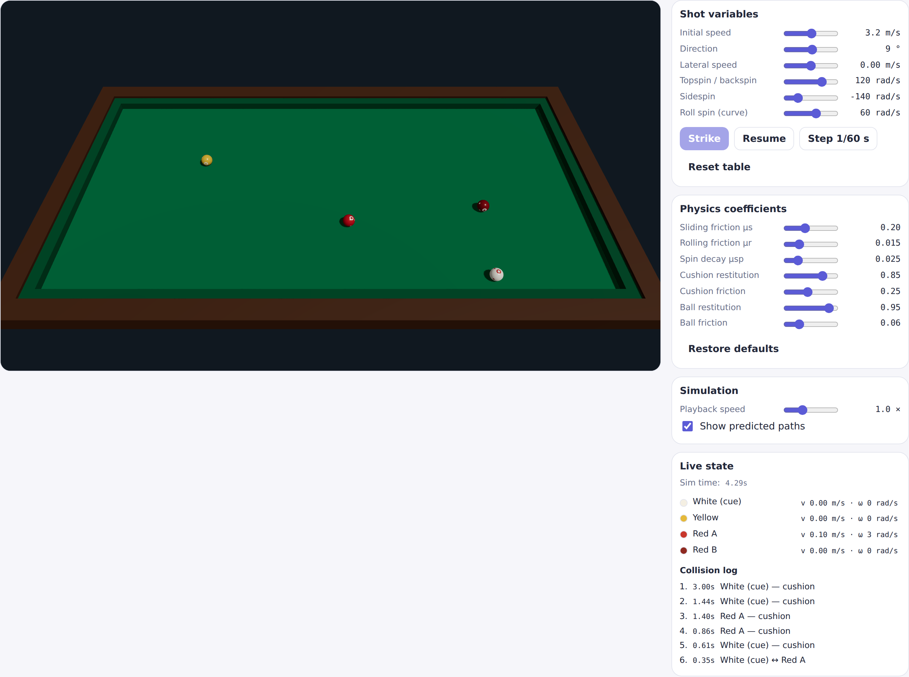
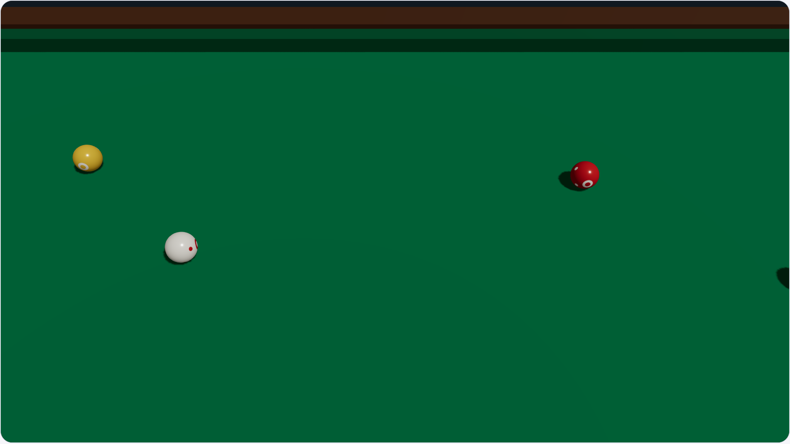

# Billiards Lab

결정론적 캐롬(4구) 당구 시뮬레이션 실험실입니다. 타격 변수(속도 벡터, 스핀 축/세기)와
물리 계수를 정하면 미끄러짐→구름 전환, 쿠션 반사, 공끼리의 충격량 교환까지 전체 진행이
고정 타임스텝 순수 연산으로 계산됩니다. 엔진이 완전히 결정론적이므로 화면의 "예측 경로"는
근사가 아니라 실제 시뮬레이션이 따라갈 궤적 그 자체입니다.

렌더링은 three.js / @react-three/fiber, 물리는 렌더링 의존성이 없는 순수 TypeScript입니다.



## 주요 기능

- **결정론적 물리 엔진** — 고정 스텝(1/600 s) 순수 함수. 같은 입력은 언제나 같은 궤적을
  만들고, 그 덕분에 예측 경로 오버레이가 실제 결과와 정확히 일치합니다.
- **쿼터니온 기반 회전** — 각 공은 단위 쿼터니온으로 자세(orientation)를 유지하며, 매
  스텝 각속도로부터 `q ← Δq(ω·dt) ⊗ q`로 적분됩니다. 구르기, 쿠션 반사, 공끼리 충돌로
  각속도가 바뀌면 그대로 눈에 보이는 회전에 반영됩니다.
- **타격 변수** — 초기 속도·방향·횡속도, 탑스핀/백스핀(밀어치기·끌어치기),
  사이드스핀(회전 반사), 롤스핀(미끄러지는 동안 휘어지는 곡선 구질)을 슬라이더로 조절.
- **물리 계수 실시간 튜닝** — 마찰(미끄럼/구름/스핀 감쇠), 쿠션·공 반발/마찰 계수를
  조절하면 예측 경로가 즉시 다시 계산됩니다.
- **시뮬레이션 제어** — 재생 속도(0.1–3×), 일시정지/재개, 1/60 s 단위 스텝 실행, 리셋.
- **라이브 상태 판독** — 공별 속도·각속도, 시뮬레이션 시계, 충돌 로그(쿠션/공, 타임스탬프).

## 스크린샷

시뮬레이션 진행 중 — 충돌 로그에 쿠션·공 충돌이 시간순으로 쌓입니다:



공 표면의 마크로 회전이 그대로 보입니다(쿼터니온 자세를 three.js에 매핑):



## 시작하기

```bash
bun install               # 의존성 설치
cp .env.example .env      # 환경 설정

DB_DRIVER=memory bun run dev   # 외부 서비스 없이 바로 실행 → http://localhost:3000/billiards
```

당구 페이지는 DB가 필요 없습니다. Todos 데모까지 Postgres로 쓰려면 `bun run db:setup` 후
`bun run dev`를 실행하세요.

| 명령            | 설명                                                                |
| --------------- | ------------------------------------------------------------------- |
| `bun run dev`   | 개발 모드 (서버 watch + 클라이언트 HMR)                             |
| `bun test`      | 단위 + 통합 테스트 — 물리 엔진의 결정론/스핀/충돌 테스트 포함       |
| `bun run check` | prettier + eslint + tsc + knip + test 전체 게이트 (pre-push와 동일) |
| `bun run build` | 프로덕션 빌드 → `dist/`                                             |

## 코드 배치

| 구성 요소                               | 경로                                    |
| --------------------------------------- | --------------------------------------- |
| 물리 엔진 (순수 TS, 렌더링 의존성 없음) | `src/shared/billiards/physics.ts`       |
| 엔진 테스트 (결정론, 스핀, 쿠션, 충돌)  | `src/shared/billiards/physics.test.ts`  |
| 시나리오 (공 배치, 기본 타격값)         | `src/client/billiards/config.ts`        |
| 시뮬레이션 상태 컨테이너 (refs + React) | `src/client/billiards/use-billiards.ts` |
| 3D 씬 (테이블, 공, 예측 경로)           | `src/client/billiards/scene.tsx`        |
| 컨트롤 패널                             | `src/client/billiards/controls.tsx`     |
| 페이지                                  | `src/client/pages/billiards-page.tsx`   |

## 물리 모델 (요약)

좌표는 테이블 평면 x/y, z 위쪽, SI 단위. 균일 밀도 동일 질량 구(`I = 2/5·m·R²`) 가정.

- **타격**: 조준 방향 쿼터니온 하나가 조준 좌표계(전방·좌측·상방)의 속도
  `(speed, lateral, ·)`와 스핀 `(−rollspin, topspin, sidespin)`을 월드 좌표로 회전.
- **미끄럼 구간**: 접점 슬립 반대 방향으로 천 마찰이 작용 — 탑스핀/백스핀이
  밀어치기/끌어치기가 되고, 롤스핀이 곡선 구질이 되는 원리.
- **구름 구간**: 무슬립 제약 아래 구름 저항으로 감속.
- **쿠션**: 법선 반발 + 접선 마찰 충격량 — 사이드스핀이 반사각을 눈에 띄게 바꿉니다.
- **공–공**: 법선 반발 충격량 + 접선 마찰 충격량(스핀 전달, "스로우").
- **회전 상태**: 공마다 단위 쿼터니온을 매 스텝 각속도로 적분 — 자세한 내용은 아래 문서로.

전체 수식과 계수 설명은 **[docs/billiards.md](docs/billiards.md)** 를 참고하세요.

## 기반 스택

이 저장소는 React + Bun 풀스택 모노레포 보일러플레이트 위에 만들어졌습니다
(검증 파사드, i18n, 디자인 시스템, in-memory/Postgres 리포지토리, CI 게이트 등).
보일러플레이트 자체의 구조와 아키텍처 결정은 **[docs/boilerplate.md](docs/boilerplate.md)**,
UI 자동화/테스트 규약은 **[docs/ui-automation.md](docs/ui-automation.md)** 에 정리되어
있습니다.
